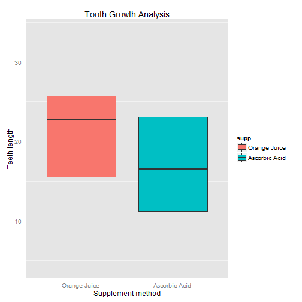
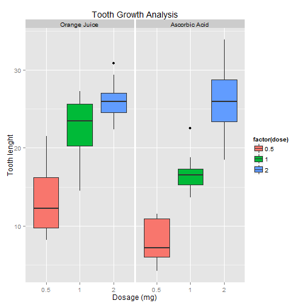
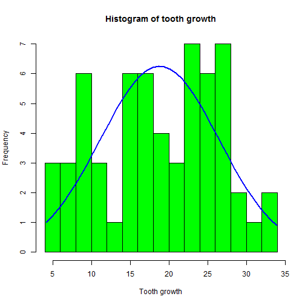

## Statistical Inference Assigment 2

This is a basic statistical inference data analysis. In this report, we are going to analyze the ToothGrowth data in the R datasets package.

### 1 - Loading the required packages and ToothGrowth data


```r
library(ggplot2)
library(datasets)
library(knitr)
library(grid)
library(gridExtra)
data(ToothGrowth)
str(ToothGrowth)
```

```
## 'data.frame':	60 obs. of  3 variables:
##  $ len : num  4.2 11.5 7.3 5.8 6.4 10 11.2 11.2 5.2 7 ...
##  $ supp: Factor w/ 2 levels "OJ","VC": 2 2 2 2 2 2 2 2 2 2 ...
##  $ dose: num  0.5 0.5 0.5 0.5 0.5 0.5 0.5 0.5 0.5 0.5 ...
```

```r
levels(ToothGrowth$supp) <- c("Orange Juice", "Ascorbic Acid")
head(ToothGrowth)
```

```
##    len          supp dose
## 1  4.2 Ascorbic Acid  0.5
## 2 11.5 Ascorbic Acid  0.5
## 3  7.3 Ascorbic Acid  0.5
## 4  5.8 Ascorbic Acid  0.5
## 5  6.4 Ascorbic Acid  0.5
## 6 10.0 Ascorbic Acid  0.5
```

### 1.1 - Performing some basic exploratory data analysis


```r
method_plot <- ggplot(aes(x = supp, y = len), data = ToothGrowth) + geom_boxplot(aes(fill = supp)) + 
                    scale_x_discrete("Supplement method") +   
                    scale_y_continuous("Teeth length") +  
                    ggtitle("Tooth Growth Analysis")

method_plot
```

 

This chart shows that OJ achieves an higher median tooth length overall compared to ascorbic acid. In addition the value of Q1 for OJ is almost as much as Q2 of ascorbic acid and OJ median is the same as the third quartile of the other administration method. Finally, when looking at the confidence intervals, OJ shows narrower upper and lower intervals.


```r
dose_plot <- ggplot(ToothGrowth,
                aes(x = factor(dose), y = len, fill = factor(dose)))

dose_plot + geom_boxplot(notch = F) + facet_grid(.~supp) +
                scale_x_discrete("Dosage (mg)") +
                scale_y_continuous("Tooth lenght") +
                ggtitle("Tooth Growth Analysis")
```

 

These charts show that an increasing dosage of both orange juice and ascorbic acid delivery method is conductive to tooth growth in guinea pigs.
Nonetheless, exploring the different dosage level in more details we observe a different impact of the delivery method on tooth growth. 

At the 0.5 mg dosage level OJ achieves a better growth as we can see from the lowest CI above the median of the other method.
This is also the case for the 1mg dose level. Although, the OJ delivery shows a wide lower CI the median is much higher than that of the ascorbic acid.  

Finally, at the 2mg dose level, we observe that the tooth growht pattern has not continued - i.e. both OJ and ascorbic acid have similar values - although the VC has mich wider IQRs and confidence intervals than OJ.


### B - Analyzing the data further providing a basic summary of the data.


```r
ToothGrowth$dose <- as.factor(ToothGrowth$dose)
summary(ToothGrowth)
```

```
##       len                   supp     dose   
##  Min.   : 4.20   Orange Juice :30   0.5:20  
##  1st Qu.:13.07   Ascorbic Acid:30   1  :20  
##  Median :19.25                      2  :20  
##  Mean   :18.81                              
##  3rd Qu.:25.27                              
##  Max.   :33.90
```
The tooth length ranges from a minimum of 4.2 to a maximum of 33.9 with a mean value of 19.25.


```r
table(ToothGrowth$supp, ToothGrowth$dose)
```

```
##                
##                 0.5  1  2
##   Orange Juice   10 10 10
##   Ascorbic Acid  10 10 10
```
We can see that in the data set there are two supplements, OJ and VC, and three dose levels - i.e. 0.5, 1, 2.


```r
hist <- hist(ToothGrowth$len, breaks = 20, col = "green", xlab = "Tooth growth", main = "Histogram of tooth growth")
xfit <- seq(min(ToothGrowth$len), max(ToothGrowth$len), length = 40)
yfit <- dnorm(xfit, mean = mean (ToothGrowth$len), sd = sd(ToothGrowth$len))
yfit <- yfit*diff(hist$mids[1:2]*length(ToothGrowth$len))
lines(xfit, yfit, col = "blue", lwd = 2)
```

 

The above notationa are confirmed by the histogram which shows different underlying distributions and large variation, suggesting multiple factors influencing the data. 


### C - Use confidence intervals and hypothesis tests to compare tooth growth by supp and dose. (Use the techniques from class even if there’s other approaches worth considering)

#### Performing the t-test by supplement type

In this test we analyze the impact of supplement type, Orange Juice and Vitamin C, on tooth growth. 


```r
t.test(len ~ supp, data = ToothGrowth)
```

```
## 
## 	Welch Two Sample t-test
## 
## data:  len by supp
## t = 1.9153, df = 55.309, p-value = 0.06063
## alternative hypothesis: true difference in means is not equal to 0
## 95 percent confidence interval:
##  -0.1710156  7.5710156
## sample estimates:
##  mean in group Orange Juice mean in group Ascorbic Acid 
##                    20.66333                    16.96333
```
The p-values is larger than 5 percent and the confidence intervals of the tests contain 0. Therefore, we fail to reject the null hypothesis and cannot conclude that there is a statistically significant difference in mean tooth growth between OJ and VC groups at the 95 percent confidence level.       


#### Subsequently, we look in more detail at how the different dosage levels and supplement type influence tooth growth.  


```r
t.test(len ~ supp, data = ToothGrowth[ToothGrowth$dose==0.5,])
```

```
## 
## 	Welch Two Sample t-test
## 
## data:  len by supp
## t = 3.1697, df = 14.969, p-value = 0.006359
## alternative hypothesis: true difference in means is not equal to 0
## 95 percent confidence interval:
##  1.719057 8.780943
## sample estimates:
##  mean in group Orange Juice mean in group Ascorbic Acid 
##                       13.23                        7.98
```

```r
t.test(len ~ supp, data = ToothGrowth[ToothGrowth$dose==1,])
```

```
## 
## 	Welch Two Sample t-test
## 
## data:  len by supp
## t = 4.0328, df = 15.358, p-value = 0.001038
## alternative hypothesis: true difference in means is not equal to 0
## 95 percent confidence interval:
##  2.802148 9.057852
## sample estimates:
##  mean in group Orange Juice mean in group Ascorbic Acid 
##                       22.70                       16.77
```

```r
t.test(len ~ supp, data = ToothGrowth[ToothGrowth$dose==2,])
```

```
## 
## 	Welch Two Sample t-test
## 
## data:  len by supp
## t = -0.0461, df = 14.04, p-value = 0.9639
## alternative hypothesis: true difference in means is not equal to 0
## 95 percent confidence interval:
##  -3.79807  3.63807
## sample estimates:
##  mean in group Orange Juice mean in group Ascorbic Acid 
##                       26.06                       26.14
```
From the above results we fail to reject the null hypothesis that there is not a statistically significant difference in mean tooth growth (i.e. means are equal) between OJ and VC groups at the 95 percent confidence level only for the 2mg dose level. 


#### Performing the t-test for the different dose levels


```r
# Subsetting the dose level groups
dose05_1 <- subset(ToothGrowth, dose %in% c(0.5, 1))

dose05_2 <- subset(ToothGrowth, dose %in% c(0.5, 2))

dose1_2 <- subset(ToothGrowth, dose %in% c(1, 2))
```

#### Comparing dose level 0.5mg to 1 mg.

```r
t.test(len ~ dose, data = dose05_1)
```

```
## 
## 	Welch Two Sample t-test
## 
## data:  len by dose
## t = -6.4766, df = 37.986, p-value = 1.268e-07
## alternative hypothesis: true difference in means is not equal to 0
## 95 percent confidence interval:
##  -11.983781  -6.276219
## sample estimates:
## mean in group 0.5   mean in group 1 
##            10.605            19.735
```

#### Comparing dose level 0.5mg to 2 mg.

```r
t.test(len ~ dose, data = dose05_2)
```

```
## 
## 	Welch Two Sample t-test
## 
## data:  len by dose
## t = -11.799, df = 36.883, p-value = 4.398e-14
## alternative hypothesis: true difference in means is not equal to 0
## 95 percent confidence interval:
##  -18.15617 -12.83383
## sample estimates:
## mean in group 0.5   mean in group 2 
##            10.605            26.100
```

#### Comparing dose level 1mg to 2 mg.

```r
t.test(len ~ dose, data = dose1_2)
```

```
## 
## 	Welch Two Sample t-test
## 
## data:  len by dose
## t = -4.9005, df = 37.101, p-value = 1.906e-05
## alternative hypothesis: true difference in means is not equal to 0
## 95 percent confidence interval:
##  -8.996481 -3.733519
## sample estimates:
## mean in group 1 mean in group 2 
##          19.735          26.100
```

When comparing tooth growth to different dose levels we reject the null hypothesis that there is no difference in the in mean (ie.e means are equal), within a 95 percent confidence interval, for all dose levels since the p-values are all very low and the confidence intervals do not contain zero.
Therefore, there is statistical significance at the 95% confidence level that the dose level has an influence on tooth growth.


### 4 - State your conclusions and the assumptions needed for your conclusions.

Based on the analysis above, we have observed that: 

1 - When observing only the supplement method, orange juice and vitamin C, there is not a statistically significant difference in tooth growth at the 95% confidence level.

2 - When we look at the supplement method and dose level, we fail to reject the null hypothesis that there is a statistically significant difference in mean tooth growth between OJ and VC groups at the 95 percent confidence level only for the 2mg dose level.

3 - When comparing tooth growth to different dose levels we reject the null hypothesis that there is no difference in the in mean, within a 95 percent confidence interval, for all dose levels.
Therefore, there is statistical significance at the 95% confidence level that the dose level has an influence on tooth growth.
